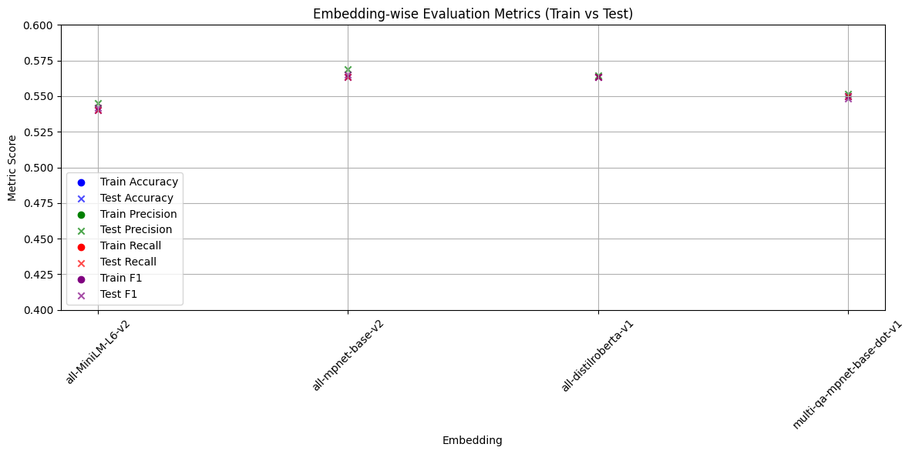

# Goal

A quick comparison of representation of text using SentenceTransformer embedding models on text classification

## Dataset

For simplicity, I utilised huggingface's Sp1786/multiclass-sentiment-analysis-dataset dataset to set benchmark betweem models. The OG dataset has around 35k examples. I restricted to first 1000 for my convenience. Among 1000, first 700 were used to train classifier model and rest to test the model.

[Link to Dataset](https://huggingface.co/datasets/Sp1786/multiclass-sentiment-analysis-dataset/viewer/default/train?row=42)
## Embedding Models

| Model Name                      | Architecture   | Size    | Speed      | Accuracy (Semantic Similarity) | Training Data (Tokens)         | Best For                             |
|---------------------------------|----------------|---------|------------|-------------------------------|--------------------------------|--------------------------------------|
| **all-MiniLM-L6-v2**            | MiniLM         | ~80MB   | ✅ Fastest  | ⚪ Good                        | ~1.5B tokens                    | Real-time search, fast inference     |
| **all-mpnet-base-v2**           | MPNet          | ~420MB  | ❌ Slower   | ✅ Best overall                | ~16B tokens                     | High-quality embeddings              |
| **all-distilroberta-v1**        | DistilRoBERTa  | ~300MB  | ⚪ Moderate | ⚪ Decent                      | ~9B tokens                      | Balanced tradeoff                    |
| **multi-qa-mpnet-base-dot-v1**  | MPNet (dual)   | ~420MB  | ❌ Slower   | ✅ Excellent for QA & retrieval | ~16B tokens (fine-tuned on QA) | Cross-lingual QA / dense retrieval   |

## Results

Conclusion: The result conveys all the models classifies more or less similarly with deviation of 5%. Among them, `all-mpnet-base-v2` embedding model outperformed all others. Considering size-performance tradeoff, I would prefer `all-MiniLM-L6-v2` as it is smaller in size yet yields competitive performance scores.

## Important Note
This comparison is indeed to quickly compare embedding models and use any of them. This does not mean anything about models semantic capture performance. And also this comparison is not the ideal comparison but a quicker version to make data scientists lives little easier.

## Reference

    1. SentenceTransformers lib: https://www.sbert.net/docs/sentence_transformer/pretrained_models.html
    2. HuggingFace lib: https://huggingface.co/
    3. Google Colab: https://colab.research.google.com/

## Credits
    README generated by: [readme.so](https://readme.so/)
    Table created by: [ChatGPT-4o](https://chatgpt.com/?model=auto)
